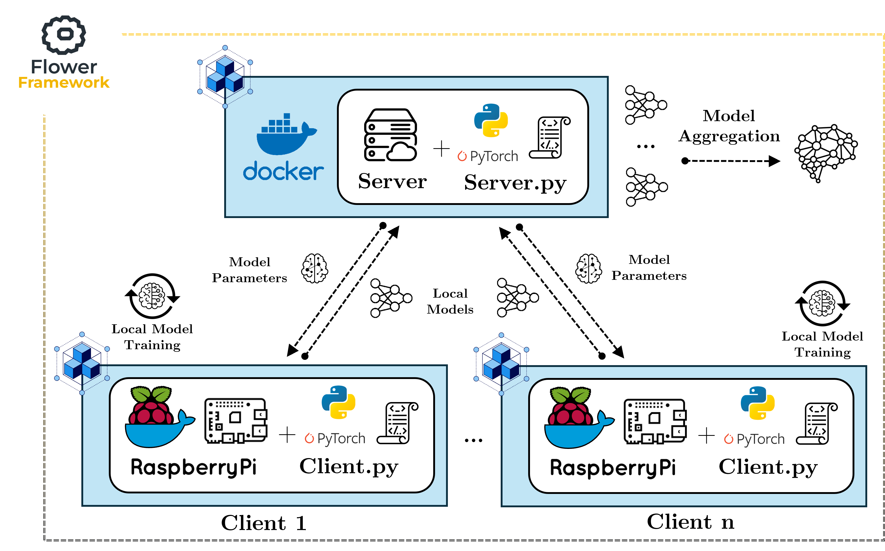

# FedBench

<p align="center">

</p>

This is the repository for testing the performance of a Federated Learning system applying custom specifications.
FedBench is supported by [Flower](https://github.com/adap/flower) Framework. 

The Flower framework was extended by adding 3 different Architectural Patterns for Clients Management [1]:

- 1 Client Selector.

- 2 Client Clustering.

- 3 Message Compressor.

# Table of contents
<!--ts-->
   * [Functionalities](#functionalities)
   * [How to run](#how-to-run)
   * [Performance](#performance)
   * [References](#references)
   
# Functionalities

This repository is divided in two main folders:

- __1. Client Selector/__: Running FL simulations considering the Client Selector pattern

- __2. Client Clustering/__: Running FL simulations considering the Client Clustering pattern

- __3. Message Compressor/__: Running FL simulations considering the Message Compressor pattern

# How To Run:

It's possible to run the framework in two ways. 

- Locally (creating virtual local images of clients and serves)

- Distributed (creating container images of clients and serves)

## To run the Simulation on Docker containers:

# Client Selector

In the target with 'docker-compose' file, enter the following command:

```bash
#Build Docker images
docker compose build

#Launch Docker images (Server, 2 Clients A with 2 CPU, 2 Client A with 1 CPU, Prometheus, Grafana)
NUM_ROUNDS=2 docker-compose up --scale clientahigh=2 --scale clientalow=2
```

# Client Clustering

In the target with 'docker-compose' file, enter the following command:

```bash
#Build Docker images
docker compose build

#Launch Docker images (Server, 2 Clients A, 2 Clients B, Prometheus, Grafana)
NUM_ROUNDS=2 docker-compose up --scale clienta=2 --scale clientb=2
```

# Message Compressor

In the target with 'docker-compose' file, enter the following command:

```bash
#Build Docker images
docker compose build

#Launch Docker images (Server, 3 Client A, 3 Client B, Prometheus, Grafana)

```

## To run the Simulation Locally:

In the target folder, enter the following command:

```bash
flower-simulation --server-app server:app --client-app client:app --num-supernodes 2 
```

Change the number of clients by modifying the value of the "--num-supernodes" variable.

# Performance

FedBench allows to generate a set of performance benchmarks (graphs) derived from the execution.
They are automatically stored in the /performance folder.

# References

[1] Sin Kit Lo, Qinghua Lu, Liming Zhu, Hye-Young Paik, Xiwei Xu, Chen Wang,
**Architectural patterns for the design of federated learning systems**,
Journal of Systems and Software, Volume 191, 2022, 111357.