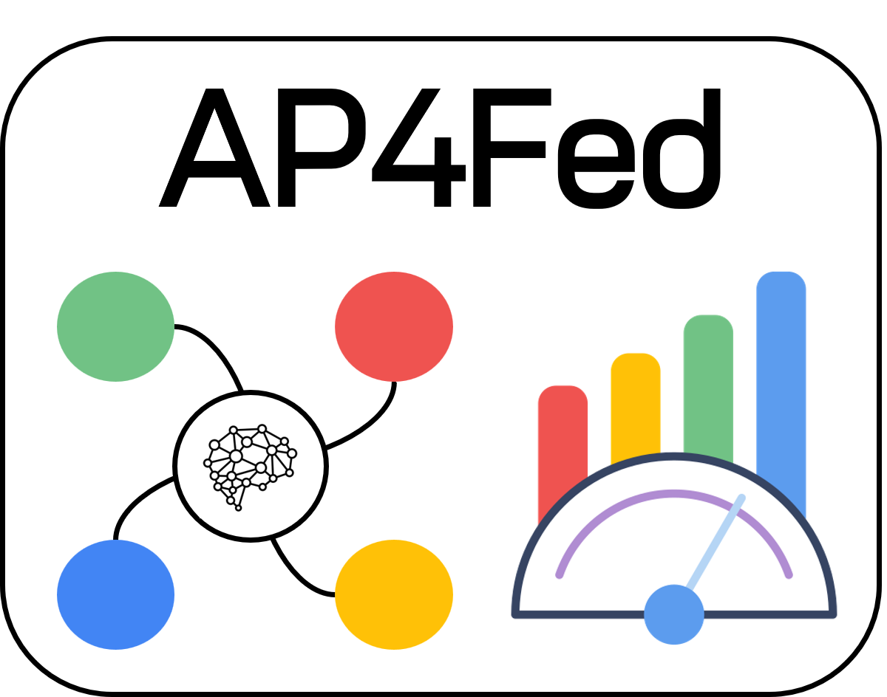

# Open Science Artifact: Performance Analysis of Architectural Patterns for Federated Learning Systems

<p align="center">

</p>


[](https://zenodo.org/uploads/14039470)

This Open Science Artifact contains a Federated Learning platform built on top of the [Flower](https://github.com/adap/flower) an open-source Python library that simplifies building Federated Learning systems.

This platform was utilized in the paper "_Performance Analysis of Architectural Patterns for Federated Learning Systems_" for the 22nd IEEE International Conference on Software Architecture (ICSA 2025).

# Table of contents
<!--ts-->
   * [Abstract](#abstract)
   * [Package Structure](#packagestructure)
   * [Prerequisites](#prerequisites)
   * [How to Run](#how-to-run)
   * [Architectural Patterns](#architecturalpatterns)
   * [References](#references)
   
# Abstract

_Context._ Designing federated learning systems is not trivial, even more so when client devices show large heterogeneity while contributing to the learning process. Architectural patterns have been recently defined in the literature to deal with the design challenges of federated learning, thus providing reusable solutions to common problems within a given context. However, patterns lead to both benefits and drawbacks, e.g., introducing a client registry improves the maintainability but it requires extra costs.    

_Objective._ The goal of this paper is to showcase the performance impact of applying architectural patterns in federated learning systems, thus pointing out the pros and cons of a selected number of three patterns.

_Method._ We extend the Flower framework, a well-assessed and unified approach to operationalize Federated Learning projects.

_Results._ Experimental results show evidence of the trade-off between system performance and learning accuracy, thus providing quantitative information to software architects and supporting them in selecting design alternatives. 

# Package Structure


The structure of this package is organized as follow:

```bash
$ tree .
.
├── /1. Client Selector      # <-- contains `Client Selector` experiments
├── /2. Client Clustering    # <-- contains `Client Cluster` experiments
├── /3. Message Compressor   # <-- contains `Message Compressor` experiments
├── Experiments Results      # <-- contains a set of charts for the visualization of the results
└── README.md                # <-- README file
```

# Prerequisites

- [Docker](https://docs.docker.com/get-docker/)
- [Docker Compose (version v2.29.2 or higher)](https://docs.docker.com/compose/install/)

Make sure to have Docker and Docker Compose installed on your system to run this project.

- **Docker**: Required to create and run containers.
- **Docker Compose**: Enables running multi-container applications with Docker using the `docker-compose.yml` file.

You can verify the installation with the following commands:
```bash
docker --version
docker compose version
```

# How To Run

To run a Federated Learning project, please refer to the README file located within the folder of the correspective architectural pattern.

Istructions to run the experiments for each architectural pattern, are reported in the README  by clicking the corresponding link in the next [section](#architectural-patterns) or by navigating directly to the folder of the specific architectural pattern.

# Architectural Patterns

The 4 Architectural Patterns proposed in [1] and implemented in our framework are:

| Architectural Pattern | Pattern Category | Description | Link |
| --- | --- | --- | --- |
| **Client Selector** | `Client Management` | A mechanism to dynamically select clients based on specific criteria, such as data distribution, device capabilities, or network conditions, to optimize the federated learning process. | [Link](1.%20Client%20Selector) |
| **Client Cluster** | `Client Management` | A strategy to group clients into clusters based on shared characteristics, such as data similarity or device attributes, improving model accuracy and convergence in non-IID data scenarios. | [Link](1.%20Client%20Cluster) |
| **Message Compressor** | `Model Management` | A component designed to reduce the size of data exchanged between clients and the server by compressing messages, which lowers communication latency and bandwidth usage in federated learning environments. | [Link](1.%20Message%20Compressor) |

The **Client Registry** architectural pattern is implemented by adding the following parameters:

| Attribute | Data Type | Description |
| --- | --- | --- | 
| **cID** | `string` | Client’s Unique Identifier | 
| **cluster_Type** | `string` | Cluster associated to the Client | 
| **n_CPU** | `int` | Number of Client’s CPU | 
| **training_time** | `float` | Client’s Training Time | 
| **communication_time** | `float` | Client’s Communication Time | 
| **total_round_time** | `float` | Client’s Total Round Time | 

# References

[1] Sin Kit Lo, Qinghua Lu, Liming Zhu, Hye-Young Paik, Xiwei Xu, Chen Wang,
**Architectural patterns for the design of federated learning systems**,
Journal of Systems and Software, Volume 191, 2022, 111357.
